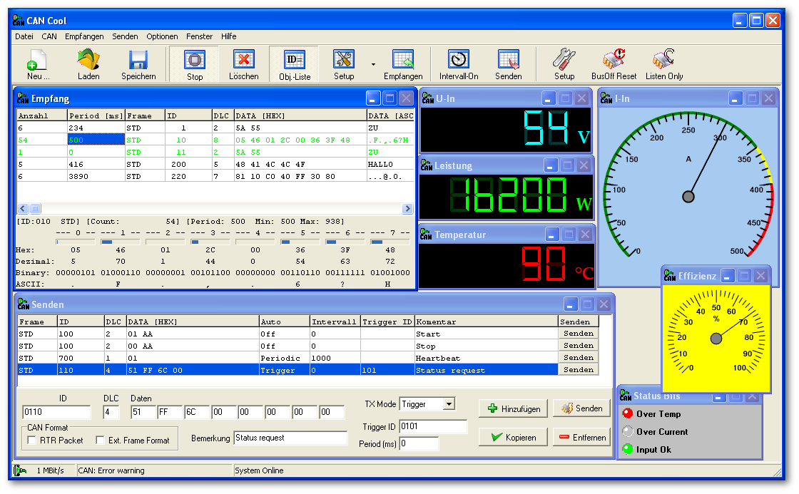

# CANcool
Open Source CAN bus Analyser and Simulation Software with CAN-FD support

## Features:
* Multithreading makes the  Can-Trace happy without any data lost
* CAN-Trace will be saved in a file
* Listing of CAN objects including statistical analysis
* Recording of individual CAN-Bus errors, only Tiny-CAN IV-XL & V-XL hardware supports this
* CAN-signals displayed as gauges, 7-Segment Displays and LEDs
* Filter function: known/ unknown/ all messages
* Application of a transmit-list, own transmit-button for each message
* Saving and loading of transmit-list directly from file
* Automatic transmit via timer, trigger message and RTR demand
* Copying of received messages directly into the transmit-list
* Muxer support with data and mask filtering

## Supported hardware:
* CAN USB adapter: Tiny-CAN I-XL – Tiny-CAN V-XL, Tiny-CAN M2
* CAN EIA-232 adapter: Tiny-CAN M232
* All hardware (USB and EIA-232) compatible to SLCAN (Serial CAN Protokoll), i.e. CANUSB from LAWICEL or USBtin from fischl
* PassThru (SAE J2534) compatible hardware: Vector, Peak, KVASER and more...

The program has been developed object-orientated in the language Pascal (Delphi 7). 
The access to the CAN dongle is based on the Delphi „Tiny-CAN“ component through the Tiny-CAN API. All used components are enclosed to the package as sources.

Please note:
The Tiny-CAN module should be run with the original firmware only. 
